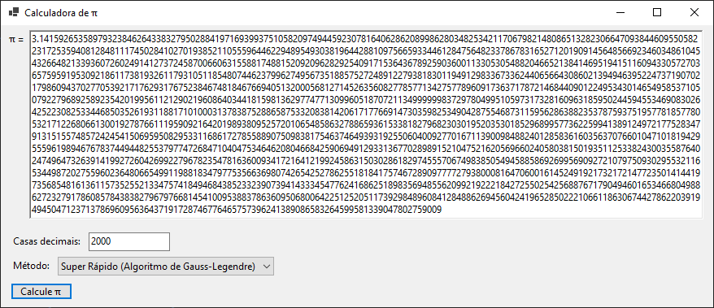

# PiDay

Um pequeno projeto com fins educacionais, criado em live no último dia do π (14/03/2025).

A live no qual este projeto foi desenvolvido por ser assistida no youtube [aqui](https://www.youtube.com/live/7VgwTriDlkU), porém algumas modificações foram feitas posteriormente em off.

Este projeto utiliza a biblioteca Pfz.Math que pode ser encontrada [aqui](https://www.codeproject.com/Articles/5366079/BigDecimal-in-Csharp). Ela foi necessária para o uso de BigDecimals no C#, uma vez que nenhuma de suas bibliotecas nativas tem suporte a esse tipo, somente a BigInteger.

Para o cálculo das casas decimais de π foram abordados três métodos durante o desenvolvimento em live:

- O primeiro deles se dá pelo cálculo direto pela avaliação de $4 \arctan{1}$, o que é muito lento para a obtenção de pelo menos 6 casas decimais.

- Posterioremente foi utilizada a fórmula de Machin, um método bastante rápido para a obtenção de dezenas de casas decimais, mas já começa a apresentar problemas para a obtenção de centenas ou mais.

- Por fim, foi apresentado o método de Gauss-Legendre, que já é bastante rápido para a obtenção de milhares de casas decimais.

Existem outros métodos mais rápidos que o de Gauss-Legendre que poderiam ser implementados neste projeto, mas fugiria do escopo da live, já que a mesma tinha apenas propósitos educacionais. Futuramente poderei estar implementando outros métodos mais rápidos, ou se preferir, você mesmo poderá fazer isso através de um fork deste projeto.
